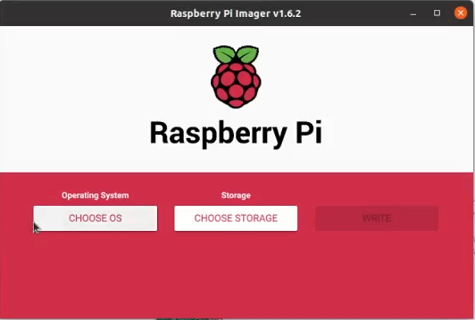
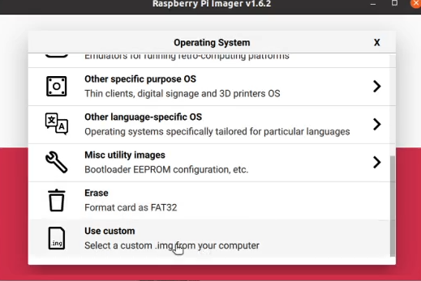
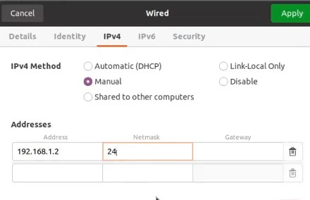
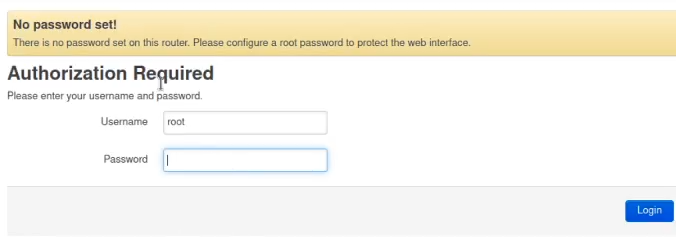
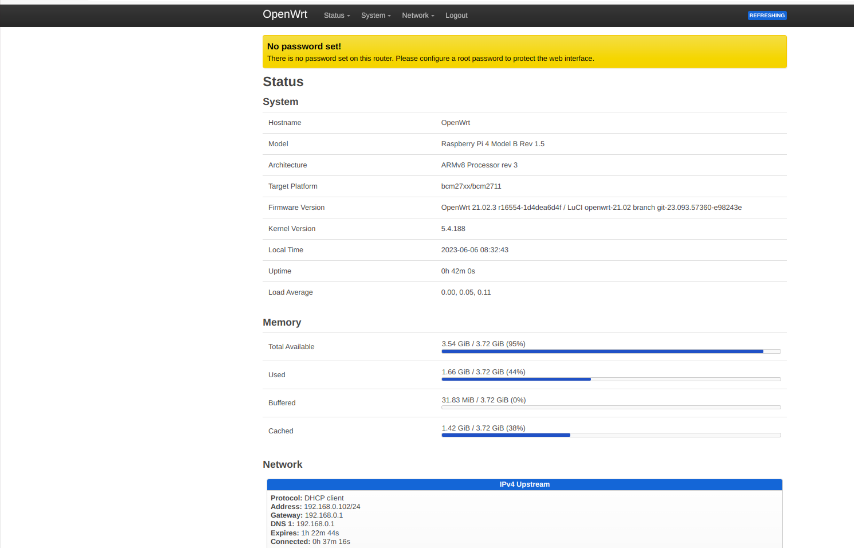

### Installation of OpenWrt on Raspberry Pi 4B
### Step 1: Use OpenWrt firmware available in directory <firmware> 
For latest version of OpenWrt Firmware for your Device (download from [here](https://firmware-selector.openwrt.org/?version=22.03.5&target=bcm27xx%2Fbcm2711&id=rpi-4)).
Download the image by selecting factory image as FACTORY (EXT4).
### Step 2: Download and install Raspberry Pi imager software (from [here](https://www.raspberrypi.com/software/)).

### Step 3: Write the downloaded image onto the SD card by inserting it into your computer.
### Step 4: Access the Raspberry Pi Imager and choose the OpenWRT image.

Click on rpi-imager
### Step 5: Then click on “Choose OS”. After that, select the option “Use custom” and the image of the OpenWRT. Then, the rpi-imager will ask to confirm and start writing to the SD card.

click on choose os

Select Use Custom
### Step 6: After transferring the image to the SD card, insert it into the Raspberry Pi and start the Raspberry Pi.
### Step 7: Connect RJ45 cable to the Raspberry Pi and your computer.
### Step 8: We need to change our computer’s wired interface network to the same range as the Raspberry Pi.
Change the computer’s wired interface IP to “192.168.1.2” using the mask “255.255.255.0” or “/24” and gateway to 192.168.0.1.

### Step 9: To access the OpenWrt WEB interface, open a browser on your computer and enter http://192.168.1.1.

No password is set initially. Simply click on "Login".

This is how you can access OpenWrt web interface. &#9996;